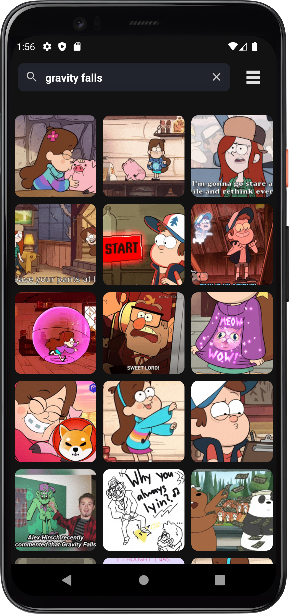
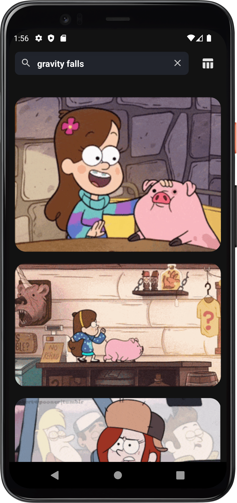
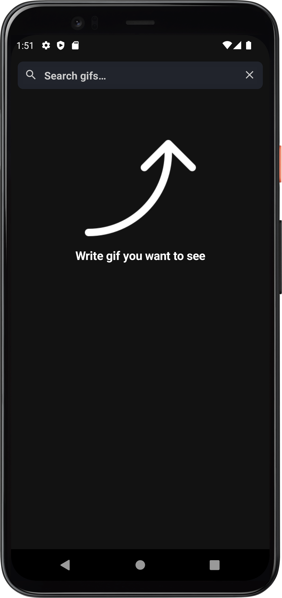

# NTestTask

This is a test task that I received from the company I wanted to get into. The project was completed in accordance with the conditions required in the assignment. What the application can do: it loads gifs using api, gifs are loaded page by page. You can enter any word and search GIFs. The project caches requests made earlier and on repeated requests it takes the response from the cache. Also, the gifs themselves are cached, which ensures offline work in the absence of the Internet. You can choose one of two types of displaying GIFs, a grid or a list. When you click on a gif, it is displayed in full size, while you can view other gifs with a swipe. For this I used a third party library. Also, when viewing a gif individually, you can click the button to stop the gif from being displayed now and on subsequent requests.

## Tech Stacks

- Retrofit2 + Mochi
- Hilt
- Kotlin, Jetpack Compose
- Glide
- Flow + Coroutines
- MVVM
- Clean Architecture

## Screenshots

